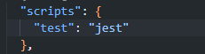
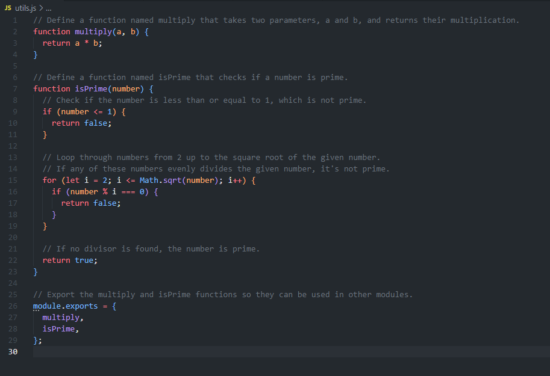
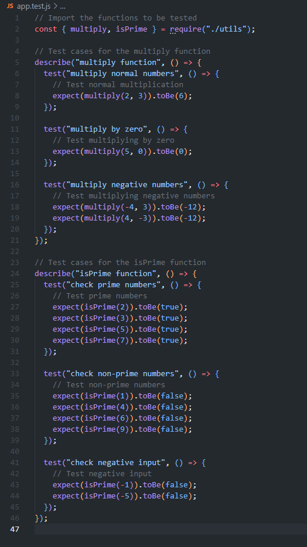

# Objective

Gain hands-on experience with Jest by setting up a Node.js environment for unit testing. Create specific utility functions, write tests to validate their functionality, and ensure your code adheres to best practices in testing.

# Instructions

## Part 1: Create and Clone Your GitHub Repository

### Create a New GitHub Repository:

Name your repository jest-testing-basics.
Initialize it with a .gitignore for Node.js and a README.md.

### Clone Your Repository:

Navigate to the cloned repository's directory to begin your project setup.

## Part 2: Setup and Configuration

### Initialize a Node.js Project:

Within your project directory, run npm init -y to generate a package.json file.

### Install Jest:

Add Jest as a development dependency with npm install --save-dev jest.
In your package.json, add a test script to run Jest:

```json
"scripts": {
  "test": "jest"
}
```

## Part 3: Writing Tests

### Utility Functions Implementation:

Create a file utils.js and implement two functions:

- multiply(a, b): Returns the multiplication of a and b.
- isPrime(number): Checks if number is a prime number.

### Testing:

Write tests for both functions in utils.test.js, covering expected behavior and edge cases. For multiply, test normal multiplication, multiplying by zero, and negative numbers. For isPrime, test prime numbers, non-prime numbers, and negative input.

## Part 4: Documentation

### Update README.md:

Document the setup process, how to run tests, and a brief explanation of each utility function and its tests.

Setup steps:
- Create a new repository and clone it down.
- Open the terminal in the repisitory folder.
- Run "npm init -y".
- Run "npm i jest".
- In package.json, configure your testing script to run jest.
  
- Create "utils.js" and add the following code:
  
- Create "app.test.js" and add the following
  
- In the terminal, run "npm test."
- Observe the test results in the terminal.
  
### Credits  
Credit to ChatGPT for explaining Jest, assistance with code, and code comments.